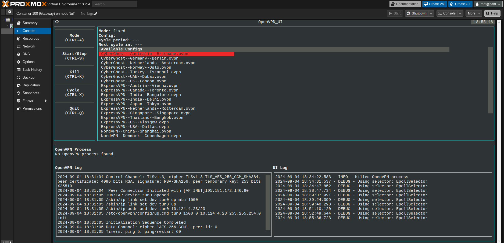

OpenVPN CLI UI running in a container's console, in Proxmox.


# OpenVPN CLI UI

OpenVPN CLI UI is a terminal-based user interface for OpenVPN built using [Textual](https://textual.textualize.io/). It allowing users to start, stop, and cycle between OpenVPN connections. It can also rotate the OpenVPN connections every N seconds automatically, mimicking Whonix/TOR's change-circuit functionality. It displays live logs for both OpenVPN and the UI itself, making it easy to monitor the system.

## Prerequisites

Before running the application, ensure the following dependencies are installed:

- Python 3.x
- OpenVPN
- Required Python packages:
  - `textual`
  - `asyncio`

You can install the dependencies using pip:

```bash
pip install textual asyncio
```

## Installation

1. Clone this repository:

```bash
git clone https://github.com/nopmop/OpenVPN_CLI_UI.git
cd OpenVPN_CLI_UI
python3 ./OpenVPN_CLI_UI.py

```

## Configuration

Make sure your `.ovpn` files are in the directory specified by `CONFIG_OPENVPN_DIR`. The UI will automatically detect and list these configurations.

```python
CONFIG_LOGFILE = "/var/log/openvpn_ui.log"
CONFIG_OPENVPN_LOGFILE = "/var/log/openvpn.log"
CONFIG_OPENVPN_CONFIG_DIR = "/etc/openvpn/config/"
CONFIG_OPENVPN_AUTH_USER_PASS = "/etc/openvpn/config/secret"
CONFIG_OPENVPN_UP_SCRIPT = "/etc/openvpn/config/up.cmd"
CONFIG_OPENVPN_DOWN_SCRIPT = "/etc/openvpn/config/down.cmd"
CONFIG_CYCLE_TIME = 3600  # Time in seconds for cycle mode
```

### Keyboard Shortcuts

- `CTRL-A`: Switch between fixed and cycle mode.
- `CTRL-S`: Start or stop the OpenVPN connection.
- `CTRL-X`: Cycle manually between configurations (only for cycle mode).
- `CTRL-K`: Forcefully kill the current OpenVPN process.
- `CTRL-Q`: Quit the application.

## Logs

- **OpenVPN Log**: Displays real-time updates from the OpenVPN log file.
- **UI Log**: Shows real-time logs for UI events, helping you debug issues or see what actions are being performed in the UI.

## Troubleshooting

- Ensure OpenVPN is correctly installed and that all the files are correctly referenced in the `CONFIG_*` variables.
- Check the logs at `/var/log/openvpn_ui.log` and `/var/log/openvpn.log` for any errors or issues.

## License

This project is licensed under the MIT License. See the [LICENSE](LICENSE) file for more details.

## Acknowledgments

This project was made possible by the [Textual](https://textual.textualize.io/) framework, providing a fantastic way to build modern terminal applications with Python. Special thanks to the OpenVPN community for maintaining an open-source VPN solution.

---

Contributions and feedback are welcome! Feel free to open issues or submit pull requests on [GitHub](https://github.com/yourusername/openvpn-ui).